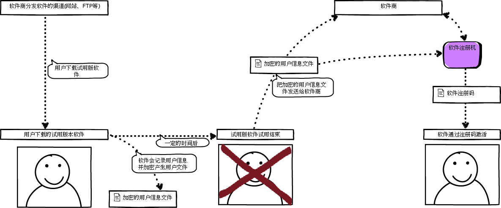
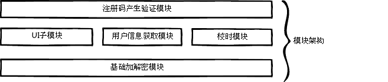

# 软件加密模块的概要设计


```
本文档为软件加密注册模块简要的设计文档，主要是为了其他人更好的理解本模块的设计思想和实现流程，也为了自己在以后修改过中能够快速熟悉模块的设计,避繁就简,就没再严格按照概要设计模板来编写.
```

******

## 1. 设计文档背景

>
该文档的设计是依据《软件加密模块的需求》来进行的设计，主要是为了解决需求中的问题，若是超过该需求的问题，可能该模块就有些不在适宜。

******

## 2. 模块使用场景




## 3. 模块基础划分

******

> * 用户信息生成子模块
> * 加解密子模块
> * UI提示接口子模块
> * 注册码的产生和验证子模块

******

### 3.1 模块间关系



### 3.2 用户信息生成子模块

> 
用户信息生成子模块用来收集用户的信息确保用户的全球唯一性，最终该文件是做为产生注册码的源文件，关于该模块的说明如下：

* 用户信息子模块最终产生为一个后缀为.userinfo的文件
* 文件内容需要经过加密子模块进行加密
* 用户信息主要包括如下内容：
 * 用户网卡MAC：6个字节
 * 用户CPU信息(CPU个数)：1个字节
 * 当前时间(距离1970年的秒数)：8个字节
 * 用户程序ID(全球唯一标识符)：36个字节的字符串


### 3.3 加解密子模块

> 
负责给予其他模块提供基础的加解密和校验的接口

### 3.4 UI提示接口子模块

>
负责给其他模块提供交互界面的接口，用来传递内部信息给用户和接受用户的反馈信息

* 消息提示框(通知、警告、错误)

### 3.5 注册码的产生和验证子模块

暂未编写

### 3.6 校时模块

暂未编写


